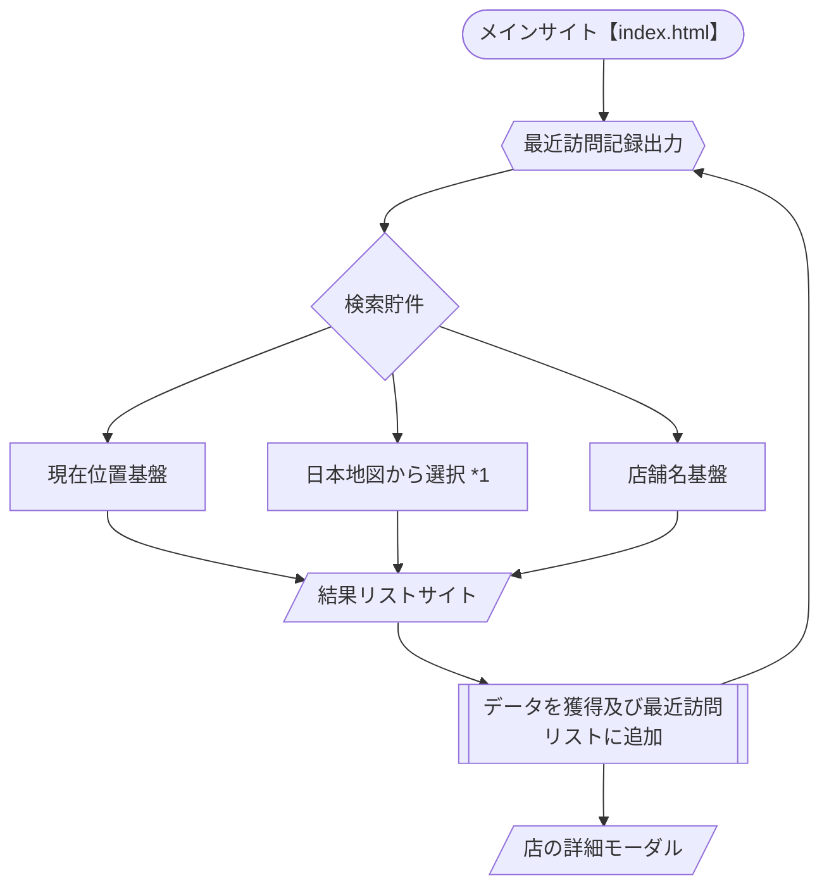

引用元
*1 日本地図リソース：https://web.contempo.jp/weblog/tips/post-7652

Docker Desktop 4.33.1
node.js 20.17.0 Alpine

Need to ssl key in .vscode folder and named localhost.key / localhost.pem, or edit in dockerfile & ssl-config.js
