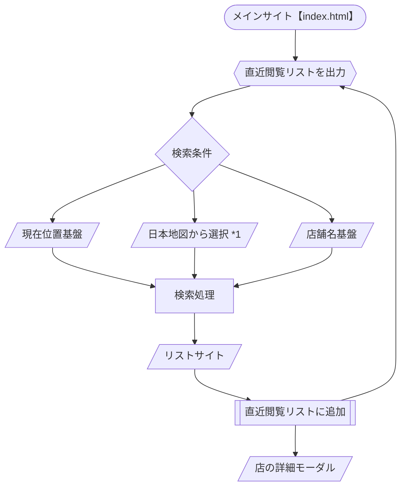

## 作動環境
- Live Server
- Docker
上記の中１つ

## Docker環境
- Docker Desktop 4.33.1
- node.js 20.17.0 Alpine
- npm 4.1.5
- live-server 1.2.2

## 機能フォローチャート

## 引用元
1. 日本地図リソース：https://web.contempo.jp/weblog/tips/post-7652

## 注意事項
- 自分のSSL認証書を使用する場合、sslフォルダにSSL認証書を入れて./dockerfileと./ssl/ssl-config.jsを修正する必要があります。
