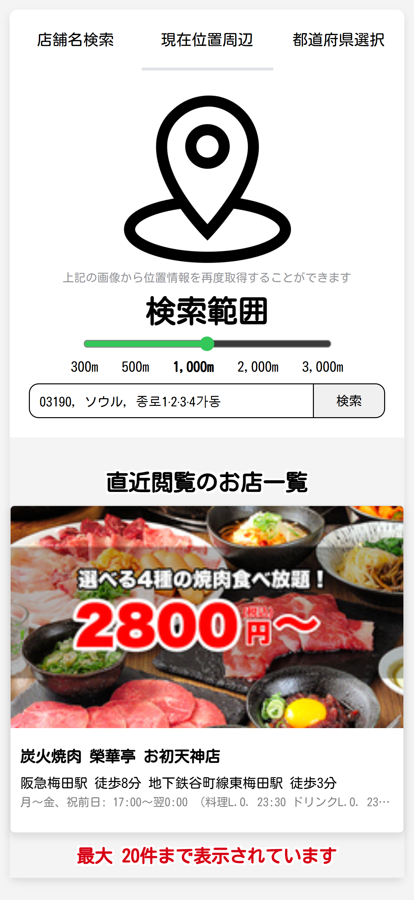
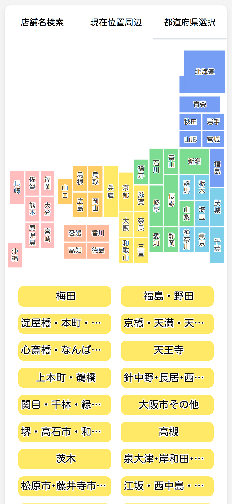
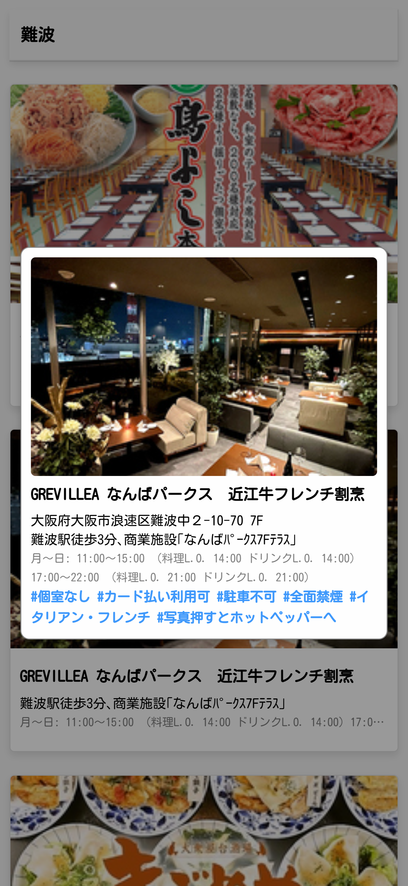

# 作動環境
- Live Server
- Docker
###### 上記の中１つ

# テスト Docker環境
- Docker Desktop 4.33.1
- node.js 20.17.0 Alpine
- npm 4.1.5
- live-server 1.2.2

# 機能フォローチャート

# 利用方法
## 店舗名検索

inputに検索する店舗名を入力して検索ボタンを押す
- 検索結果が出るまで時間がかかる場合があります。

## 現在位置周辺検索

サイト起動しGPS権限許可を要請、許可されたら自動的に現在位置が表示、検索範囲を選んで検索ボタンを押す

## 都道府県選択検索

都道府県を選択すると下部に名所が登場。続けて名所を選択すると、下位カテゴリ出て、それを選択するから検索

## 検索結果

検索結果リストから店舗を選択すると、モーダルが開けて、SNS風に情報が見られる
開けたお店はメインの直近閲覧一覧に追加

# 引用元
1. 日本地図リソース：https://web.contempo.jp/weblog/tips/post-7652

# 注意事項
- 自分のSSL認証書を使用する場合、sslフォルダにSSL認証書を入れて./dockerfileと./ssl/ssl-config.jsを修正する必要があります。
