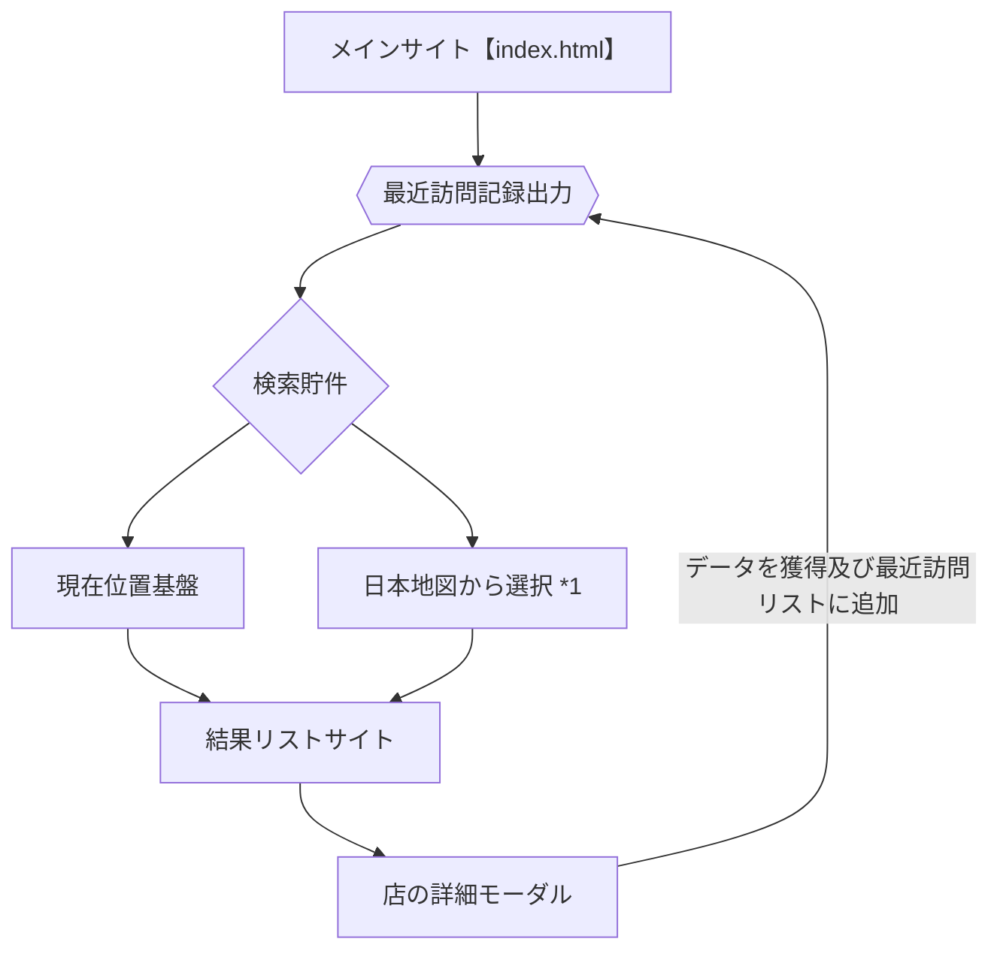

```mermaid
flowchart TD;
    A[メインサイト【index.html】]
    B[現在位置基盤]
    C[日本地図から選択 *1]
    D[結果リストサイト]
    E[店の詳細モーダル]
    A-->id1{{最近訪問記録出力}}
    id1-->id{検索貯件}
    id-->B
    id-->C
    B-->D
    C-->D
    D-->E
    E-->|データを獲得及び最近訪問リストに追加|id1
```

引用元

*1 日本地図リソース：https://web.contempo.jp/weblog/tips/post-7652
